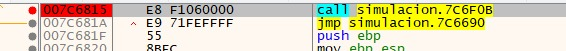
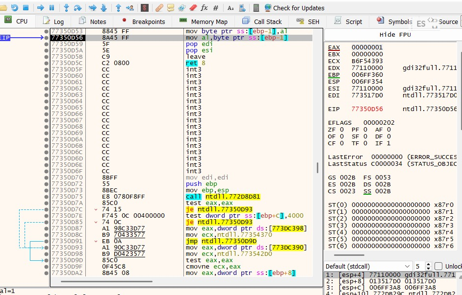
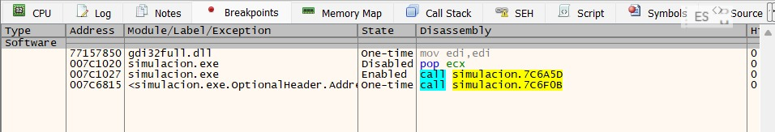

Informe de Debugging - Grupo 1
Programa: simulacion.exe

Herramienta: x32dbg

1. Punto de Interrupción Inicial (Breakpoint)
Se estableció un breakpoint de software en el EntryPoint del binario para iniciar el análisis dinámico.

Dirección: 007C6815

Instrucción: call simulacion.7C6F0B

Evidencia:

2. Análisis de Registros (Paso a Paso)
Al ejecutar el programa de forma controlada utilizando la función Step Over (F8), se observó el comportamiento de los registros del CPU.

Observación: Se nota el cambio en el registro EIP (Instruction Pointer) y las variaciones en EAX y ECX al procesar las instrucciones de carga del sistema.

Evidencia:

3. Configuración de Hardware Breakpoint (Watchpoint)
Como requisito de la práctica, se configuró un watchpoint para monitorear el acceso a direcciones específicas de memoria durante la ejecución.

Estado: Se confirma la activación de múltiples puntos de control, incluyendo el punto de entrada opcional y llamadas internas del módulo.

Evidencia:

4. Conclusión del Análisis
El binario simulacion.exe fue interceptado exitosamente. Se validó que el flujo de ejecución pasa por las librerías de sistema (ntdll.dll, gdi32full.dll) antes de ejecutar la lógica principal de la simulación.