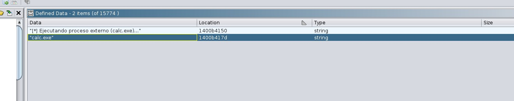
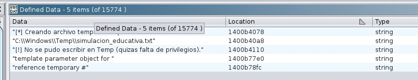
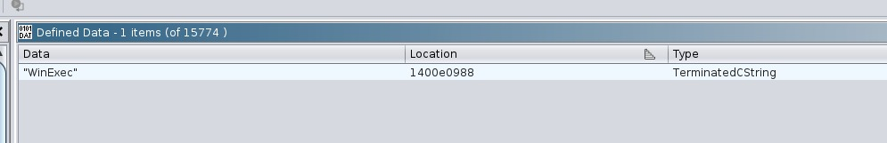

# Notas de Análisis con Ghidra - Equipo 2
**Proyecto:** Análisis de `team_sample.exe`

## 1. Localización de la Función Principal
Se utilizó la herramienta de búsqueda de strings en Ghidra para localizar el punto de entrada de la lógica del usuario. Aunque el binario tiene código de inicialización, las cadenas de texto nos permitieron saltar directamente a la función donde se ejecuta el comportamiento simulado.

---

## 2. Flujo de Ejecución y APIs Relevantes

### A. Simulación de Evasión (Anti-Sandbox)
El programa utiliza un retraso para evitar análisis automáticos. Se identificó la llamada a la función `Sleep` mediante el mensaje previo que se muestra en consola.

**Evidencia:**

### B. Creación de Artefactos (Persistencia)
Se identificó la ruta del archivo que el programa intenta crear en el sistema. Ghidra revela la dirección de memoria donde se almacena la cadena de texto de la ruta en la sección `.rdata`.

**Evidencia de ruta:**
`C:\Windows\Temp\simulacion_educativa.txt`

### C. Ejecución de Payload
Se localizó la cadena `calc.exe` y su referencia hacia la API `WinExec`. Esto confirma que el binario tiene la capacidad de lanzar procesos externos.

**Evidencias:**

---

## 3. Reconstrucción de Estructuras
Al analizar las secciones `.data` y `.rdata`, se determinó que el binario no utiliza técnicas de ofuscación o empaquetado (packing), ya que todas las estructuras de texto son legibles y las tablas de importación son visibles.

---

## 4. Conclusión
El análisis estático en Ghidra confirma que el binario `team_sample.exe` realiza una secuencia típica de malware educativo:
1. Retraso de tiempo (`Sleep`).
2. Modificación del sistema de archivos (`CreateFileA`).
3. Ejecución de proceso secundario (`WinExec`).